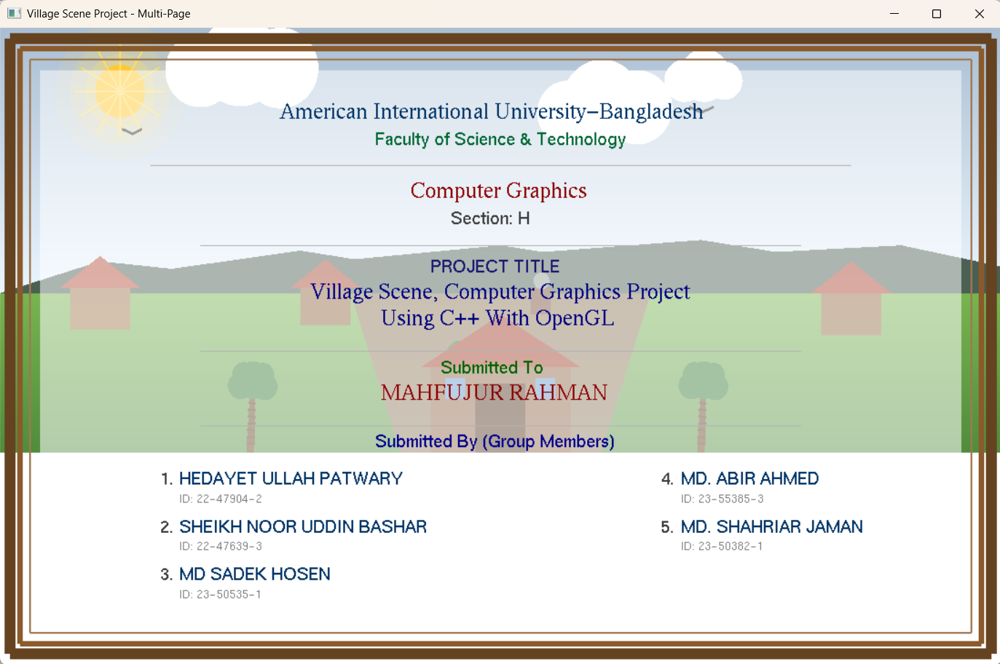
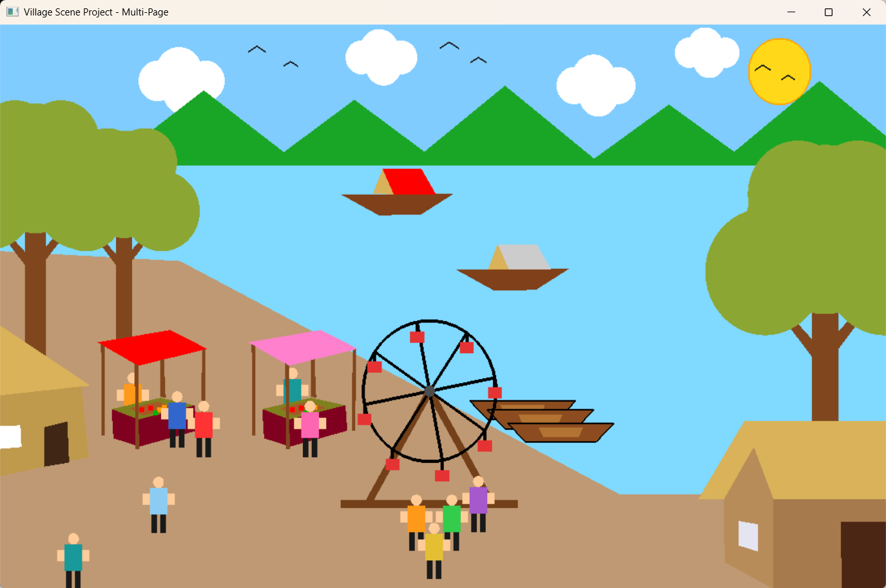
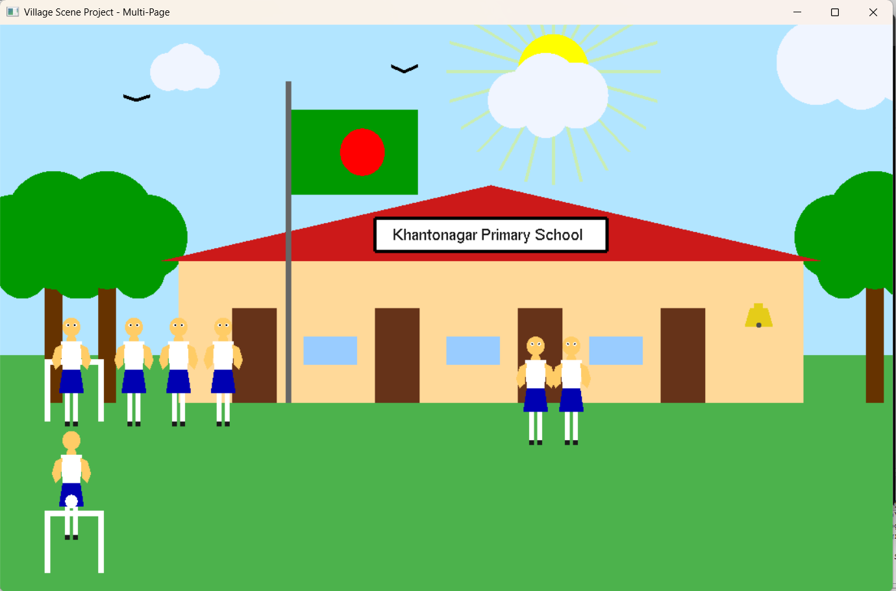
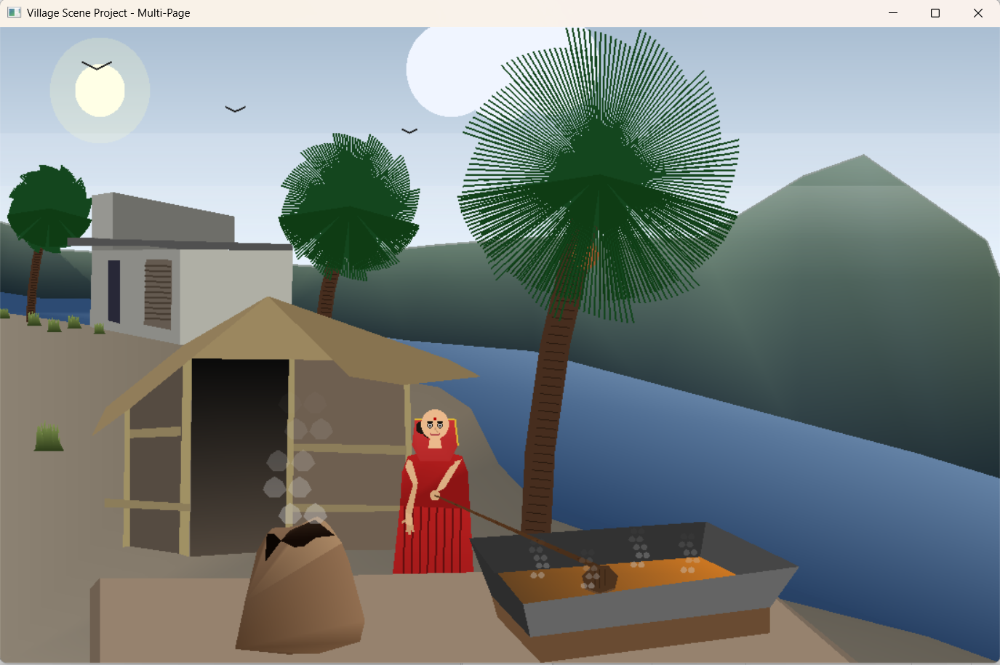
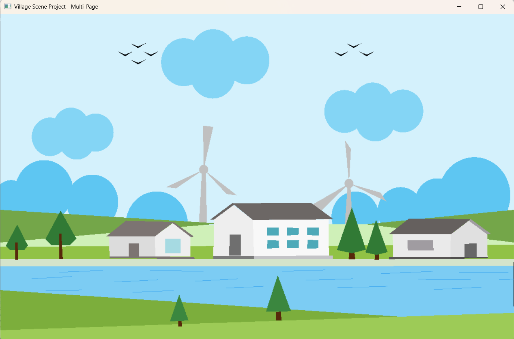
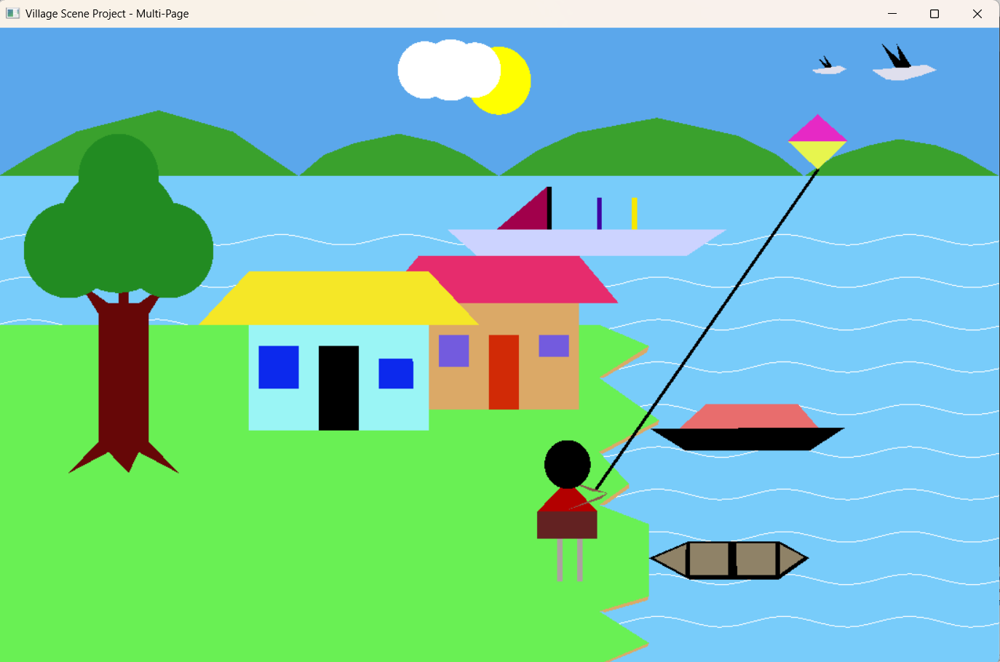

# 🏡 Village Scene — OpenGL & GLUT (C++)

A multi-scene interactive **2D Village Animation** built with **C++ using OpenGL and GLUT**, developed as a Computer Graphics course project. The project contains **6 unique animated scenes** (frames), each crafted by a different team member, with interactive keyboard controls, background music, and real-time animations.

---

## 🎬 Demo Video

[](https://www.youtube.com/watch?v=jsWVib18CM0)

> 📺 **Watch on YouTube:** [https://www.youtube.com/watch?v=jsWVib18CM0](https://www.youtube.com/watch?v=jsWVib18CM0)

---

## 🖼️ Screenshots

| Scene | Preview |
|-------|---------|
| Cover Page |  |
| Village Festival (Mela) |  |
| School Scene |  |
| Winter Day |  |
| Modern Village |  |
| Day & Night Scene |  |

---

## ⚙️ Technologies Used

- **Language:** C++
- **Graphics Library:** OpenGL, GLUT (freeglut)
- **IDE:** Code::Blocks
- **Audio:** WAV files via Windows `PlaySound` API
- **Platform:** Windows

---

## 🚀 How to Run

### Prerequisites
- Code::Blocks with MinGW
- freeglut library configured
- Windows OS

### Steps
1. Clone this repository:
   ```bash
   git clone https://github.com/YOUR_USERNAME/village-scene.git
   ```
2. Open `Village Scene.cbp` in **Code::Blocks**
3. Build & Run (`F9`)

> ⚠️ Make sure the `.wav` audio files are inside the `bin/Debug/` folder alongside the `.exe`

---

## 🎮 Controls & Navigation

### 🔀 Global Navigation (Works on All Frames)

| Key | Action |
|-----|--------|
| `→` Right Arrow or `Enter` | Go to **Next** scene |
| `←` Left Arrow or `Backspace` | Go to **Previous** scene |
| `Q` | 🔇 **Mute** background music |
| `U` | 🔊 **Unmute** background music |

---

## 🗂️ Scene Details

---

### Frame 0 — 🌅 Cover Page

> The animated introduction/welcome screen of the project.

**What's in it:**
- Animated glowing sun with light rays
- Moving clouds drifting across the sky
- Flying birds with flapping wing animation
- Swaying trees with wind effect
- Smoke rising from house chimneys
- Falling leaves animation
- Decorative border with project title and team info

**Controls:**
| Key | Action |
|-----|--------|
| `→` / `Enter` | Enter the first scene |

---

### Frame 1 — 🎪 Village Festival / Mela (Shahariyer's Scene)

> A festive village fair scene with rides, crowds, a Ferris wheel, and a movable character.

**What's in it:**
- Moving clouds and flying birds
- Two boats sailing on the river
- A spinning **Ferris wheel**
- A human character that walks in 4 directions
- Animated background with houses and trees

**Controls:**
| Key | Action |
|-----|--------|
| `W` / `↑` | Move character **Up** |
| `S` / `↓` | Move character **Down** |
| `A` | Move character **Left** |
| `D` | Move character **Right** |
| `Space` | **Stop** character movement |
| `P` | **Toggle** Ferris wheel rotation (Pause/Resume) |


---

### Frame 2 — 🏫 School Scene (Abir's Scene)

> A lively village school scene with students, a football field, a school bell, and a flag.

**What's in it:**
- Animated sun, clouds, and birds
- School building with a name board
- Students walking around the field
- A rolling **football** going back and forth
- A **school bell** that rings with animation
- An animated **flag** waving on the pole

**Controls:**
| Key | Action |
|-----|--------|
| `M` | **Start** student movement & animations |
| `S` | **Stop** all student movement |
| `B` | **Toggle** school bell ringing |


---

### Frame 3 — 🍳 Winter Day / Kitchen Scene (Labib's Scene)

> A cozy winter village scene featuring a woman cooking outdoors, with smoke, birds, and a warm atmosphere.

**What's in it:**
- Glowing animated sun with dynamic glow effect
- Moving clouds and flying birds
- A woman cooking with a **movable cooking spoon (khunti)**
- Smoke rising from the cooking fire
- Trees, huts, and a pond in the background

**Controls:**
| Key | Action |
|-----|--------|
| `R` | Move the cooking spoon to the **Right** |
| `L` | Move the cooking spoon to the **Left** |


---

### Frame 4 — 🏘️ Modern Village (Sadek's Scene)

> A vibrant modern village scene with colorful animated elements, crowds, music, and dynamic atmosphere.

**What's in it:**
- Multiple animated elements with moving parts
- Colorful decorations and village structures
- Dynamic cloud animations
- Festive background music (`village_festival.wav`)

**Controls:**
| Key | Action |
|-----|--------|
| `Q` | Mute music |
| `U` | Unmute music |

> All animations in this scene run automatically — just sit back and enjoy! 🎉


---

### Frame 5 — 🌙 Day & Night Scene (Noor's Scene)

> A dynamic riverside scene that can switch between day and night, with rain, a moving boat, and a man walking by the river.

**What's in it:**
- A riverside scene with a **moving boat**
- A **walking man** along the riverbank
- **Day/Night toggle** — sky, lighting, and colors change dynamically
- **Rain** effect that can be turned on/off
- A **house light** that can be switched on at night
- Moving clouds, birds, and animated river waves

**Controls:**
| Key | Action |
|-----|--------|
| `N` | **Toggle** Day / Night mode |
| `R` | **Start** rain |
| `S` | **Stop** rain |
| `L` | **Toggle** house light (best seen at night) |
| `+` | **Increase** boat speed |
| `-` | **Decrease** boat speed |
| `↑` Up Arrow | **Increase** wave/animation speed |
| `↓` Down Arrow | **Decrease** wave/animation speed |


---

## 👥 Team Members

| Member | Scene |
|--------|-------|
| (Cover Designer) | Frame 0 — Cover Page |
| Shahariyer | Frame 1 — Village Festival (Mela) |
| Abir | Frame 2 — School Scene |
| Labib | Frame 3 — Winter Day / Kitchen |
| Sadek | Frame 4 — Modern Village |
| Noor | Frame 5 — Day & Night Scene |

---

## 📁 Project Structure

```
Village Scene/
├── main.cpp                   # Main source file (all scenes)
├── Village Scene.cbp          # Code::Blocks project file
├── bin/
│   └── Debug/
│       ├── Village Scene.exe  # Compiled executable
│       ├── a.wav              # Navigation sound
│       ├── Abir.wav           # School scene audio
│       ├── Noor.wav           # Day/Night scene audio
│       ├── village_festival.wav  # Festival scene audio
│       └── videoplayback.wav  # Additional audio
└── screenshots/
    ├── cover.png
    ├── daynight.png
    ├── mela.png
    ├── modernvillege.png
    ├── school.png
    └── winterday.png
```

---

## 📄 License

This project was created for academic purposes as part of a **Computer Graphics** course.  
Feel free to explore, learn from it, and build upon it! ⭐

---

> ⭐ If you found this project helpful or interesting, please **star** the repository!
